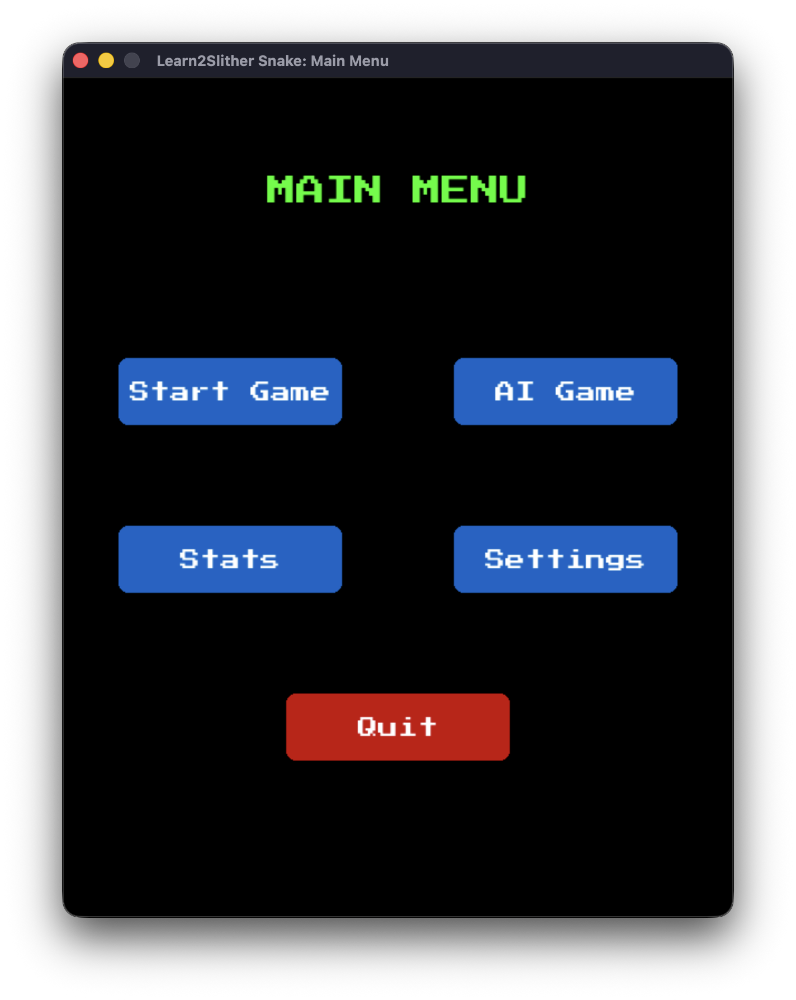
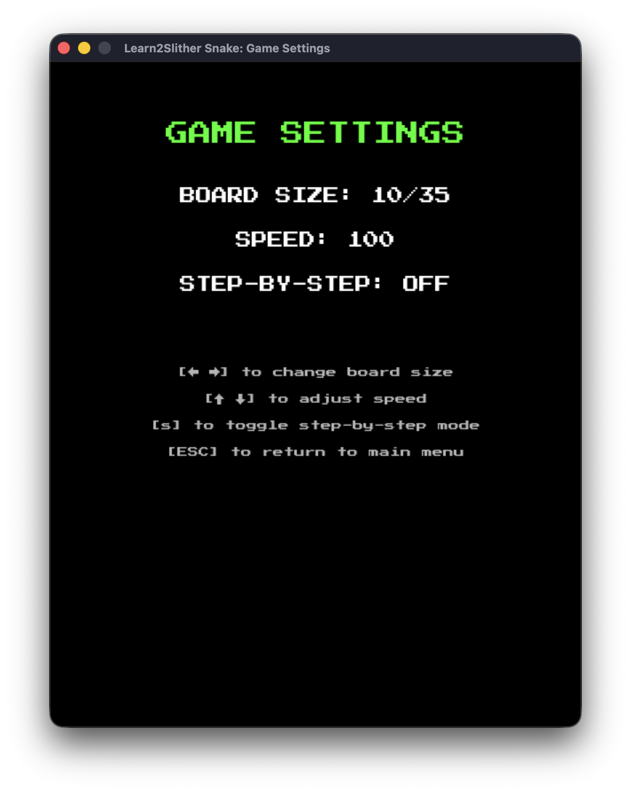
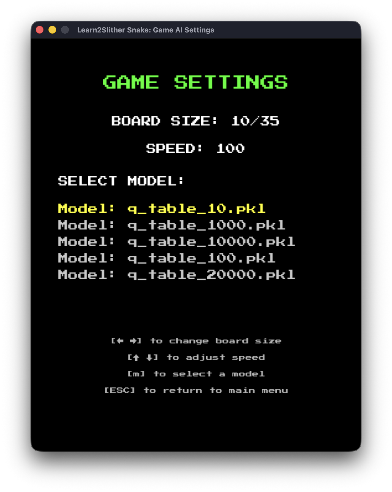
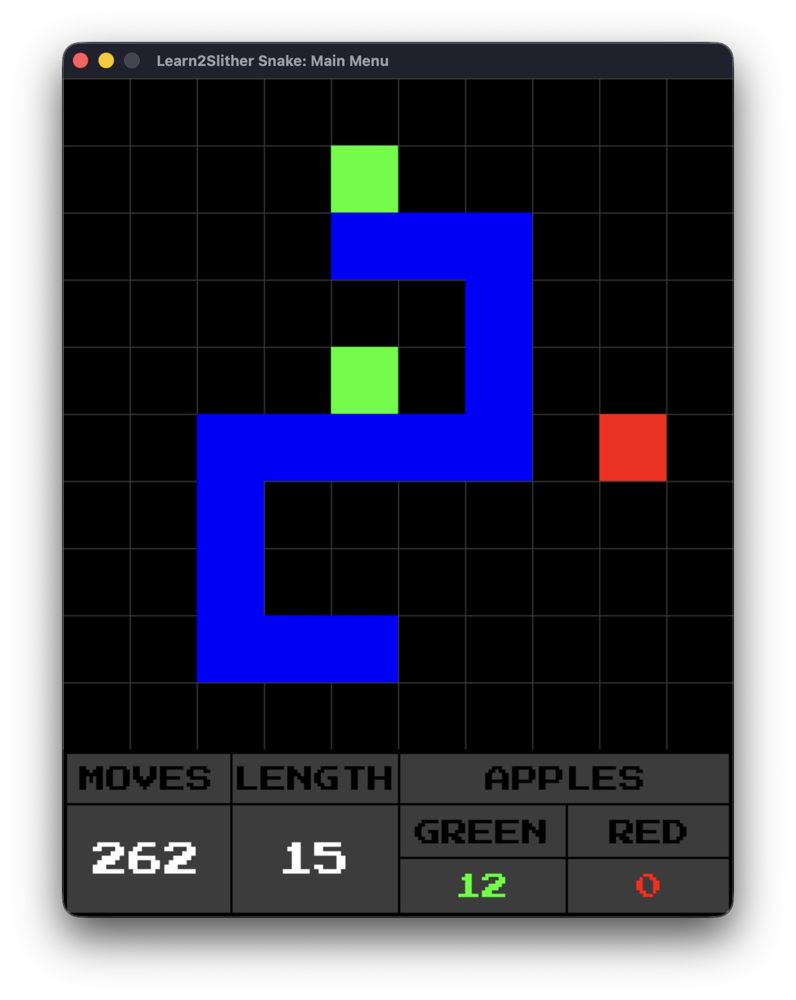
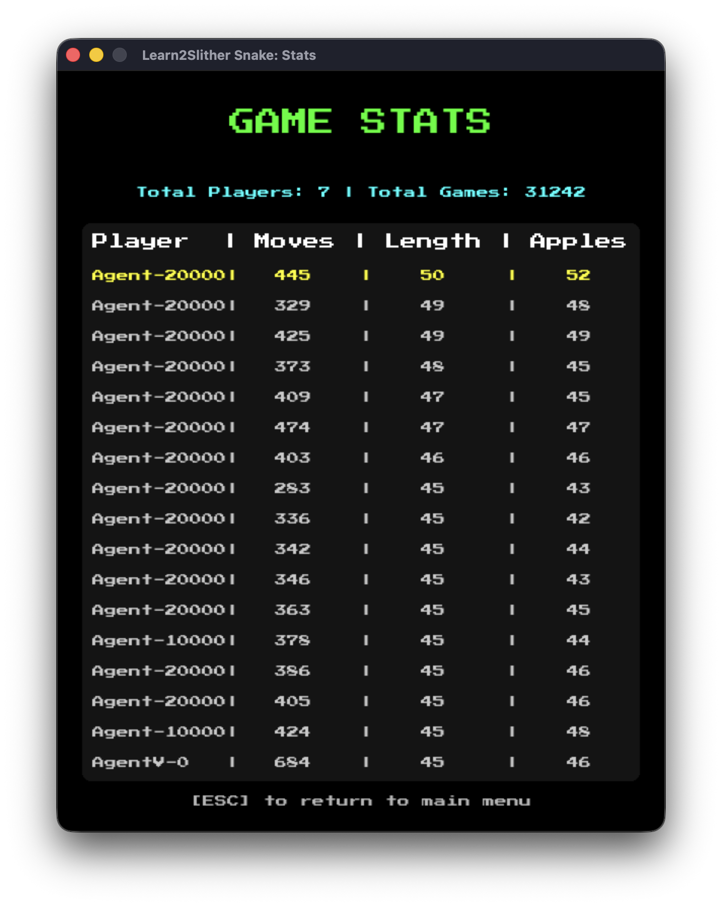

# Learn2Slither

Project developed as part of the post-core curriculum at 42 Angouleme.

---

## Description

Learn2Slither is a reinforcement learning project whose goal is to train an AI agent to play the Snake game autonomously.

The agent learns through trial and error by interacting with its environment. After each action, it receives a reward or a penalty that helps it gradually improve its strategy using the Q-Learning algorithm.

## Stack & Architecture

| Technology | Purpose |
|------------|---------|
| Python | Main language of the project |
| Pygame | Graphics rendering and input handling |
| Pandas | Training statistics analysis and processing |
| Q-Learning | Reinforcement learning algorithm based on Bellman's equation |

```bash
.
├── ai
│   ├── Qlearning_agent.py
│   └── snake_agent.py
├── assets
│   ├── GameSettings.png
│   ├── GameStats.png
│   ├── IASettings.png
│   ├── Menu.png
│   ├── PressStart2P-Regular.ttf
│   └── Snake.png
├── controllers
│   ├── agent_controller.py
│   └── human_controller.py
├── game
│   ├── apple.py
│   ├── snake.py
│   ├── snake_env.py
│   └── state.py
├── models
│   ├── q_table_10.pkl
│   ├── q_table_100.pkl
│   ├── q_table_1000.pkl
│   ├── q_table_10000.pkl
│   ├── q_table_20000.pkl
│   └── q_table_error.pkl
├── render
│   ├── button_render.py
│   ├── game_render.py
│   └── popup_render.py
├── scenes
│   ├── agent_scene.py
│   ├── ai_settings_scene.py
│   ├── game_settings_scene.py
│   ├── human_scene.py
│   ├── mainmenu_scene.py
│   ├── scene.py
│   └── stats_scene.py
├── stats
│   └── manage_csv.py
├── app.py
├── config.py
├── const.py
├── parser.py
├── README.md
└── requirements.txt

```


## Installation

```bash
python3 -m venv .venv
pip install -r requirements.txt
```

## Running the Agent

```bash
❯ python app.py -h    
usage: app.py [-h] [-sessions SESSIONS] [-save SAVE] [-visual {on,off}] [-load LOAD] [-dontlearn] [-step_by_step] [-human]

A snake that learns how to behave in an environment through trial and error, using the Q-learning algorithm.

options:
  -h, --help          show this help message and exit
  -sessions SESSIONS  Number of training sessions for the snake agent.
  -save, -s SAVE      Name of model file to be saved.
  -visual {on,off}    Enable visual mode to see the snake learning in real-time.
  -load LOAD          Name of the model to be loaded.
  -dontlearn          Disable learning mode for the snake agent.
  -step_by_step       Enable step-by-step learning mode.
  -human              Play the game as a human player.
```

---

## Q-Learning

Q-Learning is a reinforcement learning algorithm that allows an agent to learn an optimal policy without prior knowledge of the environment.

The algorithm is based on Bellman's equation:

```python
Q(s, a) = Q(s, a) + alpha * (reward + gamma * max(Q(s', a')) - Q(s, a))
```
where:
- **s**: current state
- **a**: action taken
- **reward**: reward received
- **s'**: new state
- **α**: learning rate
- **γ**: discount factor

The goal is to build a **Q-table** that stores an estimate of how good each action is for every encountered state:

```python
q_table[state] = {
    "UP": value,
    "DOWN": value,
    "LEFT": value,
    "RIGHT": value
}
```

### State Design

**Designing the state space**

The main challenge in Q-Learning is to define a state that is descriptive enough for the agent to make good decisions while keeping the state space manageable.

A state that is too simple loses important information.

A state that is too complex dramatically increases the number of possible combinations and slows down learning.

**Order of magnitude**

| State space size | Convergence |
|------------------|-------------|
| < 10,000 | Fast |
| 10,000 - 100,000 | Acceptable |
| > 1,000,000 | Tabular Q-Learning is not well suited |

> A good state encodes only the information needed for decision-making. It should maximize relevance while minimizing the number of possible combinations.

**Curse of dimensionality**

Each added variable multiplies the total number of states:

```text
4 dangers (booleans)  ->      16 states
+ direction           ->      64 states
+ exact position      ->   64,000 states
```

### My State

**State used in Learn2Slither**

The chosen state encodes:

- immediate dangers around the snake's head;
- the snake's current direction;
- a simplified vision in the four cardinal directions:
  - first object encountered in the direction
  - W, G, R
  - S is considered W
  - R, if snake.size() <= 2, is considered W

### Breakdown

| Component | Combinations |
|-----------|--------------|
| Dangers (4 booleans) | 2^4 = 16 |
| Current direction | 4 |
| Simplified vision (4 directions, 3 possible values) | 3^4 = 81 |
| **Total** | **5,184 states** |

### Example

```python
State(
    danger=(False, True, False, True),
    direction=(-1, 0),
    up="W",
    down="W",
    right="W",
    left="W"
)

Value {'UP': 0.0, 'DOWN': 0.0, 'LEFT': 0.0, 'RIGHT': 0.0}
```

**Rewards**

The agent receives rewards to guide its learning:

| Event | Reward |
|-------|--------|
| Eating a green apple | +10 |
| Eating a red apple | -5 |
| Eating a red apple when too small | -10 |
| Surviving one turn | -0.01 |
| Reaching size 0 | -100 |
| Collision with a wall | -100 |
| Collision with itself | -100 |

These rewards allow the agent to gradually learn behaviors that improve survival and achieve a higher score.

### Q-table or neural network?

Both approaches pursue the same goal, but they do not represent information in the same way.

| Approach | Principle | Advantage | Limitation |
|----------|-----------|-----------|------------|
| Q-table | Explicitly stores a value for each state/action pair | Easy to understand and quick to implement | Becomes heavy as the state space grows |
| Neural network | Approximates Q-values from the state | Generalizes better and avoids enumerating every state | More expensive to train |

In practice, the Q-table is a good fit when the state space remains manageable. It learns quickly because each update is direct.

The neural network computes an approximation of the Q-values. It requires more computation at each learning step, but it can better exploit the structure of the state and generalize across similar situations.

In short, the Q-table memorizes, while the neural network learns an approximation function.

## Bonus: Deep Learning
> Neural network learning, still based on Bellman's equation to estimate the quality of the chosen action.

### Additional stack

| Technology | Purpose |
|------------|---------|
| PyTorch | Framework used for deep learning |

### Configuration and chosen features

The state is represented by 10 values:
```python
state = [
      float(danger[0]),                    # danger up
      float(danger[1]),                    # danger down
      float(danger[2]),                    # danger left
      float(danger[3]),                    # danger right
      float(self.env.snake.direction[0]),  # dir_x
      float(self.env.snake.direction[1]),  # dir_y
      float(up_state),                     # first object encountered upward
      float(down_state),
      float(right_state),
      float(left_state),
    ]
```

The network is a simple multilayer perceptron. It has 4 layers if the input layer is counted:
- Input layer: 10 neurons, matching the 10 state values
- First hidden layer: 64 neurons
- Second hidden layer: 32 neurons
- Output layer: 4 neurons, matching the 4 possible actions

### Why these sizes?

The 10 -> 64 -> 32 -> 4 choice is a compromise between learning capacity and simplicity:
- 10 inputs to keep the state compact, readable, and stable
- 64 neurons in the first hidden layer to capture interactions between dangers, direction, and local vision
- 32 neurons in the second hidden layer to compress the information before the final decision
- 4 outputs, one per possible action, aligned directly with the Snake action space

This architecture stays lightweight, trains quickly, and helps limit overfitting on a relatively simple problem.

### Main learning step
```python
 def learn(self, state, action, reward, next_state, done):
    # 1: Convert values to tensors
    state = torch.as_tensor(np.array(state),
                dtype=torch.float32, device=DEVICE)
    next_state = torch.as_tensor(np.array(next_state),
                   dtype=torch.float32, device=DEVICE)
    action = torch.as_tensor(action, dtype=torch.long, device=DEVICE)
    reward = torch.as_tensor(reward, dtype=torch.float32, device=DEVICE)
    done = torch.as_tensor(done, dtype=torch.bool, device=DEVICE)

    # Case where each variable contains only one value
    if len(state.shape) == 1:
      state = state.unsqueeze(0)
      next_state = next_state.unsqueeze(0)
      action = action.unsqueeze(0)
      reward = reward.unsqueeze(0)
      done = done.unsqueeze(0)

    # 2: Predict the Q-value for the current state
    pred = self.model(state)

    # 3: Compute the target Q-value using Bellman's equation
    target = pred.detach().clone()

    # Use torch.no_grad() to avoid computing gradients for next_q
    with torch.no_grad():
      next_q = self.model(next_state).max(dim=1)[0]
      # Only non-terminal episodes are bootstrapped,
      # because if done, next_q is only the immediate reward.
      q_new = reward + self.gamma * next_q * (~done)
    # Update the target Q-values for the chosen actions
    target[torch.arange(len(action), device=DEVICE), action] = q_new

    # 4: Backpropagation
    self.optimizer.zero_grad()
    loss = self.criterion(target, pred)
    loss.backward()
    self.optimizer.step()
```

### Training time
> On a MacBook Pro M3, device = mps

These figures should be read as performance observations from this project, not as a general rule.
Training time depends heavily on the implementation, the hardware, and the type of agent used.

| Sessions | Time |
|---|---|
| 1_500 | 21s |
| 10_000 | 29m43s |
| 20_000 | 2h41m16s |
| 40_000 | 6h25m26s |

In my measurements, the tabular agent reaches about 17.48 average length over 40,000 sessions in much less time, while the neural network reaches about 15.98 average length over 40,000 sessions but with a much higher compute cost.

This difference is normal: the tabular agent is cheaper per update, but it depends strongly on the size of the Q-table, while the neural network pays the cost of backpropagation at every learning step.

## Game Preview






