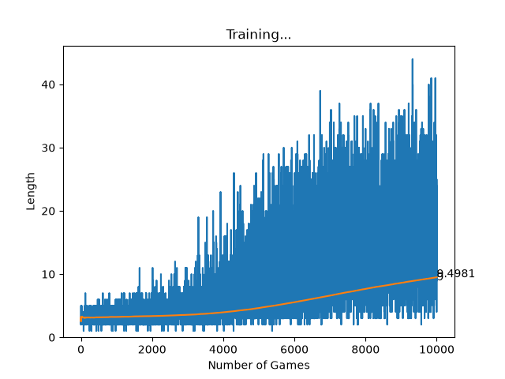
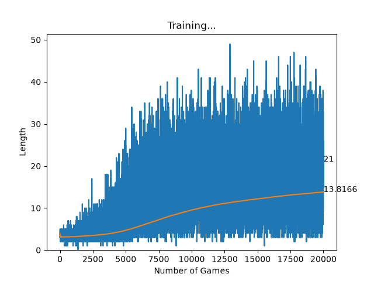
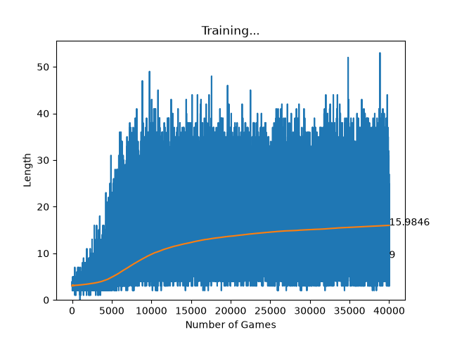
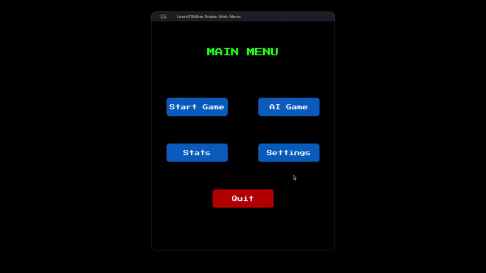

# Learn2Slither

Projet réalisé dans le cadre du cursus post tronc commun de l'école 42 Angoulême.

---

## Description

Learn2Slither est un projet d'apprentissage par renforcement dont l'objectif est d'entraîner un agent IA à jouer au jeu Snake de manière autonome.

L'agent apprend par essais et erreurs en interagissant avec son environnement. À chaque action effectuée, il reçoit une récompense ou une pénalité lui permettant d'améliorer progressivement sa stratégie grâce à l'algorithme de Q-Learning.

## Stack & Architecture

| Technologie | Utilisation |
|------------|-------------|
| Python | Langage principal du projet |
| Pygame | Gestion du rendu graphique et des interactions |
| Pandas | Analyse et traitement des statistiques d'entraînement |
| Q-Learning | Algorithme d'apprentissage par renforcement basé sur l'équation de Bellman |

```bash
.
├── ai
│   ├── Qlearning_agent.py
│   └── snake_agent.py
├── assets
│   ├── GameSettings.png
│   ├── GameStats.png
│   ├── IASettings.png
│   ├── Menu.png
│   ├── PressStart2P-Regular.ttf
│   └── Snake.png
├── controllers
│   ├── agent_controller.py
│   └── human_controller.py
├── game
│   ├── apple.py
│   ├── snake.py
│   ├── snake_env.py
│   └── state.py
├── models
│   ├── q_table_10.pkl
│   ├── q_table_100.pkl
│   ├── q_table_1000.pkl
│   ├── q_table_10000.pkl
│   ├── q_table_20000.pkl
│   └── q_table_error.pkl
├── render
│   ├── button_render.py
│   ├── game_render.py
│   └── popup_render.py
├── scenes
│   ├── agent_scene.py
│   ├── ai_settings_scene.py
│   ├── game_settings_scene.py
│   ├── human_scene.py
│   ├── mainmenu_scene.py
│   ├── scene.py
│   └── stats_scene.py
├── stats
│   └── manage_csv.py
├── app.py
├── config.py
├── const.py
├── parser.py
├── README.md
└── requirements.txt

```


## Installation

```bash
python3 -m venv .venv
pip install -r requirements.txt
```

## Lancement de l'agent

```bash
❯ python app.py -h    
usage: app.py [-h] [-sessions SESSIONS] [-save SAVE] [-visual {on,off}] [-load LOAD] [-dontlearn] [-step_by_step] [-human]

A snake that learns how to behave in an environment through trial and error, using the Q-learning algorithm.

options:
  -h, --help          show this help message and exit
  -sessions SESSIONS  Number of training sessions for the snake agent.
  -save, -s SAVE      Name of model file to be saved.
  -visual {on,off}    Enable visual mode to see the snake learning in real-time.
  -load LOAD          Name of the model to be loaded.
  -dontlearn          Disable learning mode for the snake agent.
  -step_by_step       Enable step-by-step learning mode.
  -human              Play the game as a human player.
```

---

## Q-Learning

Le Q-Learning est un algorithme d'apprentissage par renforcement permettant à un agent d'apprendre une politique optimale sans connaissance préalable de l'environnement.

L'algorithme repose sur l'équation de Bellman :

```python
Q(s, a) = Q(s, a) + α × (reward + γ × max(Q(s', a')) − Q(s, a))
```
où :
- **s** : état courant
- **a** : action effectuée
- **reward** : récompense obtenue
- **s'** : nouvel état
- **α** : taux d'apprentissage (*learning rate*)
- **γ** : facteur de réduction (*discount factor*)

L'objectif est de construire une **Q-table** contenant une estimation de la qualité de chaque action pour chaque état rencontré :

```python
q_table[state] = {
    "UP": value,
    "DOWN": value,
    "LEFT": value,
    "RIGHT": value
}
```

### Choix du state


**Conception de l'espace d'états**

La principale difficulté du Q-Learning consiste à définir un état suffisamment descriptif pour permettre à l'agent de prendre de bonnes décisions tout en conservant un espace d'états raisonnable.

Un état trop simple entraîne une perte d'informations importantes.

Un état trop complexe augmente fortement le nombre de combinaisons possibles et ralentit l'apprentissage.

**Ordre de grandeur**

| Taille de l'espace d'états | Convergence |
|---------------------------|-------------|
| < 10 000 | Rapide |
| 10 000 – 100 000 | Acceptable |
| > 1 000 000 | Q-Learning tabulaire peu adapté |

> Un bon état encode uniquement les informations nécessaires à la prise de décision. Il doit maximiser la pertinence tout en minimisant le nombre de combinaisons possibles.

**Malédiction de la dimensionnalité**

Chaque variable ajoutée multiplie le nombre total d'états :

```text
4 dangers (booléens)  ->      16 états
+ direction           ->      64 états
+ position exacte     ->   64 000 états
```

### Mon state

**État utilisé dans Learn2Slither**

L'état retenu encode :

- les dangers immédiats autour de la tête ;
- la direction actuelle du serpent ;
- une vision simplifiée dans les quatre directions cardinales:
  - Premier élément rencontré dans la direction
  - W , G , R
  - S est considéré comme W
  - R si snake.size() <= 2 est considéré comme W

### Décomposition

| Composant | Combinaisons |
|-----------|-------------|
| Dangers (4 booléens) | 2⁴ = 16 |
| Direction courante | 4 |
| Vision simplifiée (4 directions, 3 valeurs possibles) | 3⁴ = 81 |
| **Total** | **5 184 états** |

### Exemple

```python
State(
    danger=(False, True, False, True),
    direction=(-1, 0),
    up="W",
    down="W",
    right="W",
    left="W"
)

Valeur {'UP': 0.0, 'DOWN': 0.0, 'LEFT': 0.0, 'RIGHT': 0.0}

q_table[State] = Valeur
```

**Récompenses**

L'agent reçoit des récompenses afin d'orienter son apprentissage :

| Événement | Récompense |
|-----------|------------|
| Consommation d'une pomme verte | +10 |
| Consommation d'une pomme rouge | -5|
| Consommation d'une pomme rouge si trop petit | -10|
| Survie d'un tour | -0.01 |
| Passage à une taille 0 |-100 |
| Collision avec un mur | -100 |
| Collision avec lui-même | -100 |

Ces récompenses permettent à l'agent d'apprendre progressivement les comportements favorables à sa survie et à l'obtention d'un score élevé.

### Q-table ou réseau neuronal ?

Dans ce projet, les deux approches poursuivent le même objectif, mais elles ne représentent pas l'information de la même manière.

| Approche | Principe | Avantage | Limite |
|----------|----------|----------|--------|
| Q-table | Stocker explicitement une valeur pour chaque paire état/action | Simple à comprendre, rapide à mettre en place | Devient vite très lourde quand l'espace d'états grandit |
| Réseau neuronal | Approximer les valeurs Q à partir de l'état | Généralise mieux et évite d'énumérer tous les états | Plus coûteux à entraîner |

En pratique, la Q-table est adaptée quand l'espace d'états reste raisonnable. Elle apprend vite, car chaque mise à jour est directe.

Le réseau neuronal, lui, calcule une approximation des valeurs Q. Il demande plus de calcul à chaque apprentissage, mais il peut mieux exploiter la structure de l'état et mieux généraliser entre des situations proches.

Autrement dit, la Q-table mémorise, tandis que le réseau neuronal apprend une fonction d'approximation.

## Bonus : Deep Learning
> Apprentissage par réseau de neurones, en utilisant toujours la formule de Bellman pour estimer la qualité de l'action choisie.

### Stack supplémentaire

| Technologie | Utilisation |
|------------|-------------|
| PyTorch | Framework utilisé pour le deep learning |

### Configuration et caractéristiques retenues

L'état est représenté par 10 valeurs :
```python
state = [
            float(danger[0]),                    # danger haut
            float(danger[1]),                    # danger bas
            float(danger[2]),                    # danger gauche
            float(danger[3]),                    # danger droite
            float(self.env.snake.direction[0]),  # dir_x
            float(self.env.snake.direction[1]),  # dir_y
            float(up_state),                     # premier élément rencontré vers le haut
            float(down_state),
            float(right_state),
            float(left_state),
        ]
```

Le réseau est un perceptron multicouche simple. Il comporte 4 couches si l'on compte la couche d'entrée :
- Couche d'entrée : 10 neurones, correspondant aux 10 valeurs de l'état
- Première couche cachée : 64 neurones
- Deuxième couche cachée : 32 neurones
- Couche de sortie : 4 neurones, correspondant aux 4 actions possibles

### Pourquoi ces tailles ?

Le choix 10 → 64 → 32 → 4 correspond à un compromis entre capacité d'apprentissage et simplicité :
- 10 entrées pour représenter un état compact, lisible et stable
- 64 neurones sur la première couche cachée pour capturer les interactions entre les dangers, la direction et la vision locale
- 32 neurones sur la seconde couche cachée pour condenser l'information avant la décision finale
- 4 sorties, une par action possible, en cohérence directe avec l'espace d'actions du Snake

Cette architecture reste légère, s'entraîne rapidement et limite le risque de surapprentissage sur un problème relativement simple.

### Algo principal
```python
 def learn(self, state, action, reward, next_state, done):
        # 1: Convertit les variables en tenseurs
        state = torch.as_tensor(np.array(state),
                                dtype=torch.float32, device=DEVICE)
        next_state = torch.as_tensor(np.array(next_state),
                                     dtype=torch.float32, device=DEVICE)
        action = torch.as_tensor(action, dtype=torch.long, device=DEVICE)
        reward = torch.as_tensor(reward, dtype=torch.float32, device=DEVICE)
        done = torch.as_tensor(done, dtype=torch.bool, device=DEVICE)

        # Cas où il n'y a qu'une seule valeur par variable
        if len(state.shape) == 1:
            state = state.unsqueeze(0)
            next_state = next_state.unsqueeze(0)
            action = action.unsqueeze(0)
            reward = reward.unsqueeze(0)
            done = done.unsqueeze(0)

        # 2: Prédiction de la valeur Q avec l'état courant
        pred = self.model(state)

        # 3: Calcul de la valeur Q cible avec la formule de Bellman
        target = pred.detach().clone()

        # Utilisation de torch.no_grad() pour ne pas calculer les gradients pour next_q
        with torch.no_grad():
            next_q = self.model(next_state).max(dim=1)[0]
            # On ne calcule que les épisodes non terminés,
            # car si done, next_q est uniquement la récompense immédiate.
            q_new = reward + self.gamma * next_q * (~done)
        # Mise à jour des valeurs Q cibles pour les actions choisies
        target[torch.arange(len(action), device=DEVICE), action] = q_new

        # 4: Backpropagation (rétropropagation)
        # Calcul de la perte entre les valeurs Q prédites et cibles
        # 1- Initialisation des gradients à zéro avant la rétropropagation
        # 2- Calcul de la perte entre les valeurs Q prédites et cibles
        # 3- Calcul de la passe arrière pour calculer les gradients
        # 4- Mise à jour des poids du modèle à l'aide de l'optimiseur
        self.optimizer.zero_grad()
        loss = self.criterion(target, pred)
        loss.backward()
        self.optimizer.step()
```

### Durée d'entraînement
> Sur un MacBook pro M3, device= mps

Les mesures ci-dessous doivent être lues comme des observations de performance sur ce projet, pas comme une règle générale.
Le temps dépend fortement de l'implémentation, du matériel et du type d'agent utilisé.

| Sessions | Temps |
|---|---|
| 1_500 | 21s |
| 10_000 | 29m43s |
| 20_000 | 2h41m16s |
| 40_000 | 6h25m26s |

À titre de comparaison, dans mes mesures, l'agent tabulaire atteint environ 17,48 de longueur moyenne sur 40 000 sessions en beaucoup moins de temps, alors que le réseau neuronal atteint environ 15,98 de moyenne sur 40 000 sessions mais avec un coût de calcul beaucoup plus élevé.

Ce contraste est normal : l'agent tabulaire met moins de temps par mise à jour, mais il dépend fortement de la taille de la Q-table, alors que le réseau neuronal paie le coût de la rétropropagation à chaque apprentissage.

### Stats d'entraînement Deep Learning





</br>

## Aperçu du jeu

<video width="300" height="200" controls>
  <source src="https://youtu.be/NLY8kAvp5kU" type="video/mp4">
</video>

[](https://www.youtube.com/watch?v=NLY8kAvp5kU)


